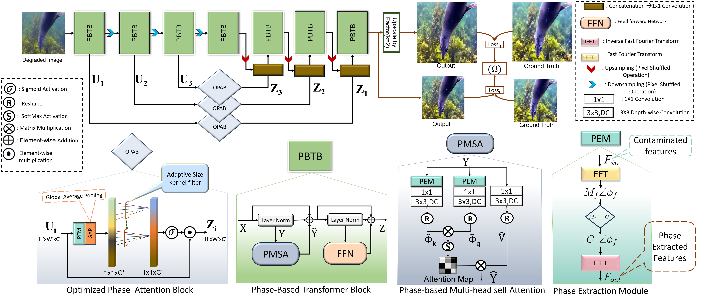
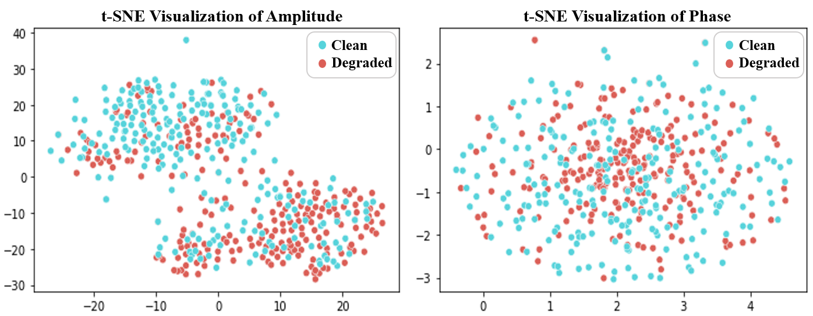

<p align="center">
  <h1 align="center">Phaseformer : Phase-based Attention Mechanism for Underwater Image Restoration and Beyond</h1>
  <p align="center">
    <a href="https://mdraqibkhan.github.io">Md Raqib Khan</a>
    ·
    <a href="https://scholar.google.com/citations?user=UcUMYe8AAAAJ&hl=en&oi=sra">Anshul Negi</a>
    ·
    <a href="https://scholar.google.com/citations?user=WwdYdlUAAAAJ&hl=en&oi=sra">Asuhtosh Kulkarni </a>
    ·
    <a href="https://scholar.google.com/citations?user=HgX8wb8AAAAJ&hl=en&oi=sra">Shruti S. Phutke</a>
    ·
    <a href="https://visionintelligence.github.io">Santosh Kumar Vipparthi</a>
    ·
    <a href="https://www.scss.tcd.ie/~muralas/">Subrahmanyam Murala</a>
  </p>
  <h3 align="center">WACV-2025</h3>
  <h3 align="center"><a href="https://arxiv.org/pdf/2412.01456">Paper</h3>
 <div align="center"></div>
</p>
<div align="center">
    
    <h1>Phaseformer : Phase-based Attention Mechanism for Underwater Image Restoration and Beyond</h1>
</div>
  
  <div align="center"></div>
</p>
<div align="center">
    
    <h1>t-SNE Visualization of the Amplitude and Phase of Clean and Degraded Images</h1>
    <p>
        The separate clusters for clean and degraded amplitude show that there is more effect of degradation 
        on amplitude content compared to phase content, which has overlapping clusters for clean and noisy images.
    </p>
</div>


# Evaluation 

To evaluate the model on different datasets using the provided checkpoints and sample degraded images.

## Dataset and Checkpoint Structure

- **Sample degraded images for testing**: Available in `dataset/dataset_name/`.
- **Checkpoints for evaluation**: Provided in `checkpoints/dataset-name/`.
- **Results storage**: After successful execution, the results will be saved in the `results/dataset-name/` folder.

### Folder Overview 
```
├── dataset
│   ├── UIEB
│   ├── U-45
│   ├── SQUID
│   ├── UCCS
│   ├── UFO-120
│   ├── Low_light
├── checkpoints
│   ├── UIEB
│   ├── UFO-120
│   ├── Low_light
├── results
│   ├── UIEB
│   ├── U-45
│   ├── SQUID
│   ├── UCCS
│   ├── UFO-120
│   ├── Low_light

```
## Running the Evaluation

To evaluate the model on different datasets, follow the instructions below for each specific dataset:

### UIEB Dataset Evaluation
Run the following command to evaluate the model on the UIEB dataset:
```
python test.py --dataset datasets/UIEB/  --checkpoints_path /checkpoints/UIEB/ --save_path Results/UIEB 
```

###  U-45 Dataset Evaluation
Run the following command to evaluate the model on the U-45 dataset:
```
python test.py --dataset dataset/U-45/ --checkpoints_path /checkpoints/UIEB/ --save_path Results/U-45
```
### SQUID Dataset Evaluation
Run the following command to evaluate the model on the SQUID dataset:
```
python test.py --dataset dataset/SQUID/ --checkpoints_path /checkpoints/UIEB/ --save_path Results/SQUID
```
### UCCS Dataset Evaluation
Run the following command to evaluate the model on the UCCS dataset:
```
python test.py --dataset dataset/UCCS/ --checkpoints_path /checkpoints/UIEB/ --save_path Results/UCCS

```
### UFO-120 Dataset Evaluation
Run the following command to evaluate the model on the UCCS dataset:
```
python test.py --dataset dataset/UFO-120/ --checkpoints_path /checkpoints/UFO-120/ --save_path Results/UFO-120

```
### Low-light Dataset Evaluation
Run the following command to evaluate the model on the UCCS dataset:
```
python test.py --dataset dataset/UCCS/ --checkpoints_path /checkpoints/Low_light/ --save_path Results/Low_light

```

## Traing
1. Structure of data for training should be like

 ```Shell
 uw_data/   # here uw_data can be any underwater datsets folder like UIEB,UFO-120 etc.
    ├── train/
    │   ├── a/  # Input images
    │   └── b/  # Reference (ground truth) images
    └── test/
        ├── a/  # Input images
        └── b/  # Reference (ground truth) images
```

3. run
```
  pyhthon train.py
```


## Citation
If you find this work helpful, please reference it as follows:
```
 @article{khan2024phaseformer,
  title={Phaseformer: Phase-based Attention Mechanism for Underwater Image Restoration and Beyond},
  author={Khan, MD and Negi, Anshul and Kulkarni, Ashutosh and Phutke, Shruti S and Vipparthi, Santosh Kumar and Murala, Subrahmanyam},
  journal={arXiv preprint arXiv:2412.01456},
  year={2024}
}
```


## Acknowledgements 
Special thanks to the awesome repositories [UIPTA](https://github.com/Mdraqibkhan/UIEPTA) and [Spectroformer](https://github.com/Mdraqibkhan/Spectroformer), which made this project possible.


